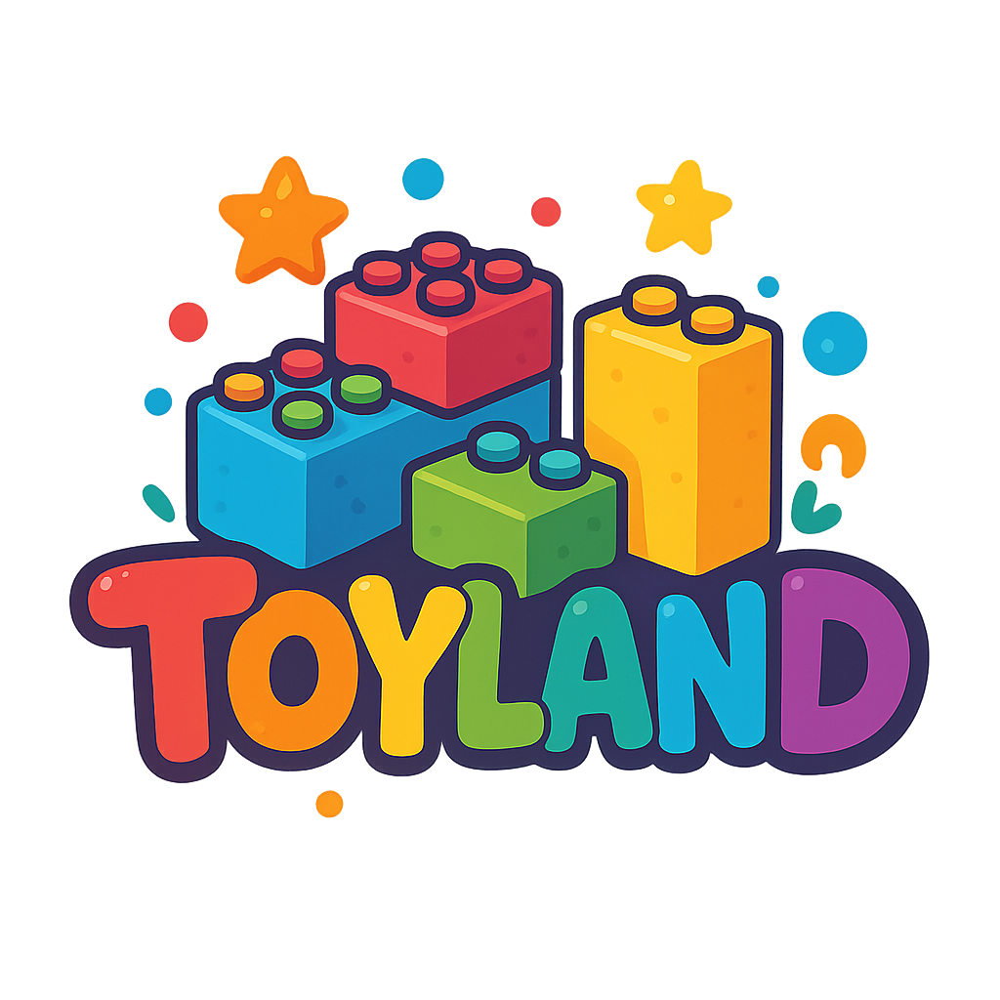

# ToyLand - ร้านของเล่นออนไลน์

<div align="center">
  
  <p><em>ร้านของเล่นออนไลน์คุณภาพดี ปลอดภัยสำหรับเด็กทุกวัย</em></p>
</div>

## 📋 รายละเอียดโปรเจค

ToyLand เป็นเว็บไซต์ร้านค้าออนไลน์จำลองสำหรับจำหน่ายของเล่นเด็ก พัฒนาด้วย HTML, CSS และ JavaScript แบบ Vanilla (ไม่ใช้เฟรมเวิร์ค) โปรเจคนี้มีจุดประสงค์เพื่อสาธิตการสร้างเว็บไซต์อีคอมเมิร์ซอย่างง่ายพร้อมฟังก์ชันสำคัญ

### ✨ คุณสมบัติหลัก

- 🏠 หน้าแสดงสินค้าทั้งหมดในรูปแบบกริด
- 🔍 ระบบกรองสินค้าตามหมวดหมู่
- 📝 หน้าแสดงรายละเอียดสินค้า
- 🛒 ระบบตะกร้าสินค้า (ใช้ LocalStorage)
- 💰 หน้าชำระเงินพร้อมฟอร์มกรอกข้อมูล
- ✅ หน้ายืนยันคำสั่งซื้อ
- 📱 การแสดงผลที่รองรับทุกขนาดหน้าจอ (Responsive Design)

## 🚀 การติดตั้งและใช้งาน

1. **Clone repository นี้**
   ```bash
   git clone https://github.com/username/toyland-shop.git
   cd toyland-shop
   ```

2. **เปิดใช้งานเว็บไซต์**
   - เปิดไฟล์ `index.html` ด้วยเว็บเบราว์เซอร์
   - หรือใช้ Live Server: หากมี VS Code ติดตั้ง Live Server Extension แล้วคลิกขวาที่ `index.html` และเลือก "Open with Live Server"

## 📂 โครงสร้างโปรเจค

```
toyland/
│
├── index.html                 # หน้าหลักแสดงสินค้าทั้งหมด
├── product-details.html       # หน้าแสดงรายละเอียดสินค้า
├── cart.html                  # หน้าตะกร้าสินค้า
├── checkout.html              # หน้าชำระเงิน
├── confirmation.html          # หน้ายืนยันการสั่งซื้อ
│
├── css/
│   ├── style.css              # ไฟล์ CSS หลัก
│   ├── header.css             # CSS สำหรับส่วนหัว
│   ├── product-details.css    # CSS สำหรับหน้ารายละเอียดสินค้า
│   ├── cart.css               # CSS สำหรับหน้าตะกร้าสินค้า
│   ├── checkout.css           # CSS สำหรับหน้าชำระเงิน
│   ├── confirmation.css       # CSS สำหรับหน้ายืนยันการสั่งซื้อ
│   └── responsive.css         # CSS สำหรับการแสดงผลบนอุปกรณ์ต่างๆ
│
├── js/
│   ├── main.js                # JavaScript หลัก
│   ├── products.js            # ข้อมูลสินค้า
│   └── cart.js                # ฟังก์ชันจัดการตะกร้าสินค้า
│
└── images/
    ├── logo.png               # โลโก้ร้าน
    ├── banners/               # รูปภาพแบนเนอร์
    └── products/              # รูปภาพสินค้า
```

## 💡 ฟีเจอร์ในรายละเอียด

### การแสดงสินค้า
- แสดงสินค้าในรูปแบบกริด
- แสดงแบดจ์ "ลดราคา" สำหรับสินค้าที่มีส่วนลด
- แสดงราคาเดิมและราคาหลังลดสำหรับสินค้าลดราคา
- แสดงคะแนนรีวิวด้วยดาว

### ระบบตะกร้าสินค้า
- เพิ่มสินค้าลงตะกร้า
- แก้ไขจำนวนสินค้าในตะกร้า
- ลบสินค้าออกจากตะกร้า
- บันทึกข้อมูลตะกร้าใน localStorage

### การชำระเงิน
- ฟอร์มกรอกข้อมูลการจัดส่ง
- เลือกวิธีการชำระเงิน
- ตรวจสอบความถูกต้องของข้อมูล

## 🛠️ เทคโนโลยีที่ใช้

- **HTML5** - โครงสร้างเว็บไซต์
- **CSS3** - การจัดรูปแบบและ Responsive Design
- **JavaScript (ES6+)** - การทำงานฝั่งไคลเอนต์
- **LocalStorage API** - จัดเก็บข้อมูลตะกร้าสินค้า
- **Font Awesome** - ไอคอนต่าง ๆ

## 📝 การพัฒนาต่อยอด

ไอเดียสำหรับการพัฒนาต่อยอดในอนาคต:

1. เพิ่มระบบล็อกอินและสมาชิก
2. เพิ่มระบบคะแนนและรีวิวสินค้า
3. พัฒนาระบบค้นหาสินค้า
4. เพิ่มระบบโปรโมชั่นและคูปองส่วนลด
5. เชื่อมต่อกับ API การชำระเงินจริง (เช่น PayPal, Stripe)
6. เพิ่มระบบติดตามสถานะการจัดส่ง

---

